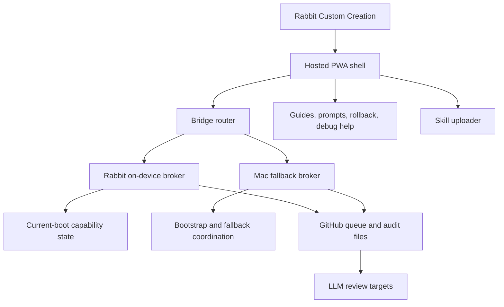

# Rabbit Superuser Management Roadmap and Wireframe

## Product Shape

One Rabbit Custom Creation launches one hosted/installable PWA. The PWA is the
single control surface for custom creations, broker state, request composition,
safe dry runs, skill upload, audit lookup, and guided setup.

The PWA does not directly root the device. It validates intent, shows expected
outputs and blockers, queues dry-run requests, and routes approved requests to
the active broker.

## Rabbit UI Standard

- Keep every status line, URL, JSON block, and long description inside its
  parent boundary.
- Show short summaries first. Put long diagnostics behind tap-to-expand detail
  blocks.
- Keep Rabbit-facing tools portrait-first. Do not add manual rotate controls
  unless a future app has been visually verified on the target screen.
- Do not let cards, buttons, previews, or labels resize the page wider than the
  Rabbit viewport.

## Target Architecture



## Screen Wireframe

```text
+--------------------------------------------------+
| Superuser Management                             |
| Status chips: PWA cached | Broker route | Lease  |
| [Check setup] [Detect route] [Approval] [Gateway] |
+----------------------+---------------------------+
| Creation Folders     | First Run / Readiness     |
| - Media Tools        | - Asset checks            |
| - Developer Tools    | - Cache support           |
| - Device Utilities   | - Broker reachability     |
| - AI Assistants      | - Manifest availability   |
+----------------------+---------------------------+
| Enablement Wizard                                |
| Step title, expected result, stop condition       |
| [Back] [Mark complete] [Next] [Build dry run]     |
+--------------------------------------------------+
| Bridge Routing                                   |
| Endpoint, route target, blockers, hints           |
| [Detect] [Refresh] [Queue dry run]                |
+----------------------+---------------------------+
| Superuser Actions    | Device Modes              |
| - Reboot             | - Normal reboot           |
| - ADB USB            | - Recovery                |
| - ADB TCP/IP         | - Fastboot                |
| - Storage export     | - USB storage mode        |
+----------------------+---------------------------+
| Skill Uploader       | Audit / Rollback / Debug   |
| File picker, parser  | Search, export handoff     |
+--------------------------------------------------+
```

## Roadmap

### Phase 1 - Published PWA Acceptance

- Confirm live GitHub Pages app loads on desktop and Rabbit-size viewport.
- Confirm manifest and service worker assets load from production.
- Confirm UI remains readable with touch-sized controls.
- Use the GitHub-hosted QR launch sheet for PWA launch, Creation import, and
  lease pairing.

### Phase 2 - Safe Broker Integration

- Start Mac local broker only on host.
- Enforce broker startup cleanup: close or yield previous broker route, clear
  stale transient configuration, preserve audit/queue/rollback state, and write
  audit evidence before accepting new requests.
- Confirm PWA broker detection using `/health`, `/bridge/route`, `/broker/service`, and `/adb/status`.
- Keep endpoints dry-run only.
- Expand audit archive rotation and query tooling for the 1,500 active record policy.
- Use `npm run audit:status`, `npm run audit:archive`, and `npm run audit:query`
  for active/archive audit maintenance.

### Phase 3 - Rabbit Import Test

- With explicit live approval, open the PWA on Rabbit and verify install/cache behavior.
- Import or call the single Custom Creation manifest.
- Run first-run readiness only.
- Do not run privileged actions during this test.

### Phase 4 - On-Device Broker Scaffold

- Build a non-root broker scaffold for Rabbit-local request validation, dry-run queueing, audit writes, and bridge route selection.
- Add capability detection without changing system state.
- Add offline debug/rollback guide access.

### Phase 5 - Privilege Path Research Gate

- No implementation until the exact live Rabbit state is rechecked.
- Require separate approval for any ADB, fastboot, WebUSB/WebSerial, DA, root, or boot-cycle action.
- Keep any temporary elevated state current-boot scoped and non-persistent.

## Open Decisions

- Whether generated QR PNG files should also be committed, beyond the hosted QR page.
- Whether audit archives should remain static JSONL files or move to a small indexed bundle.
- Which Rabbit runtime surface can reliably host the on-device broker scaffold.
- Whether the final broker protocol should use JSON files only, HTTP endpoints only, or both.
